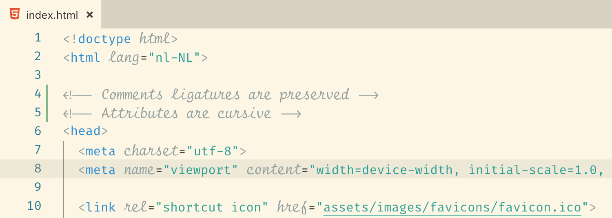
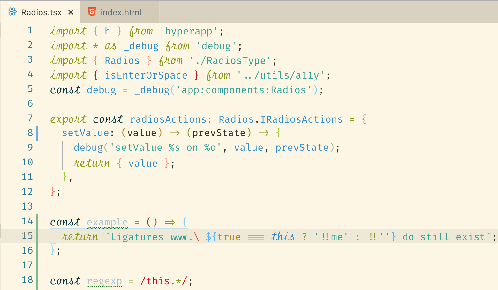

<div style="padding: 0 25px 0">
  <div align="center">
    
  </div>
</div>
<h1 align="center">Solarized Light Differentiated</h1>
<h3 align="center" style="border:none">
Theme to accomplish fine grained customization in combination with Cursive Font
(custom-css) and Ligatures (Fira Code) using Fira Code iScript</h3>
<div align="center">
  
  
</div>
<br/>
</div>

> This theme is an extension of the original Solarized Light theme. It's purpose is to add italics to the keywords with minimal changes using Custom CSS

## Demo's

Html


Typescript


- [Demo's](#demos)
- [Usage](#usage)
- [Problem description](#problem-description)
- [Solution](#solution)
- [Contributions](#contributions)

## Usage

1. Install font `Fira Code iScript` from [kencrocken/FiraCodeiScript](https://github.com/kencrocken/FiraCodeiScript)
2. Use the font in VSCode settings (fontSize and anti-aliasing is optional)
```json
"editor.fontFamily": "'Fira Code iScript', monospace",
"editor.fontLigatures": true,
"editor.fontSize": 15.5,
"workbench.fontAliasing": "antialiased",
```
3. Install this theme from VSCode.
4. Install extension [Custom Css and Js](https://marketplace.visualstudio.com/items?itemName=be5invis.vscode-custom-css) in VSCode
5. Configure custom css in your VSCode config
```json
"vscode_custom_css.imports": ["file:///Users/user/projects/vscode-css.css"],
```
6. With the following contents (to make cursive "monospaced")
```css
.mtki {
  margin-left: 1px;
  font-size: 1.2em;
}
```


## Problem description

Using the custom css alternative for Operator Mono is pretty cumbersome because of the [Optimizations in Syntax Highlighting](https://code.visualstudio.com/blogs/2017/02/08/syntax-highlighting-optimizations) that removed a lot of the classes and replaced them with keywords like `.mtk12` `.mtki` `.mtkb` etc.

## Solution

This theme requires only minor customizations using the 'Custom CSS and Js Loader' extension.

This theme is explicitly setting `font-style: italic` for these scopes (like Operator Mono does):

- keyword.control
- storage.type
- variable.language.this
- entity.other.attribute-name
- comment.block

Furthermore, there are Ligatures available in Fira Code that we want to use. For that the theme defines specific rules:

- storage.type.function.arrow
- punctuation.definition.comment

## Contributions

Any contribution is welcome. Please provide a good use case when things aren't the way we expect